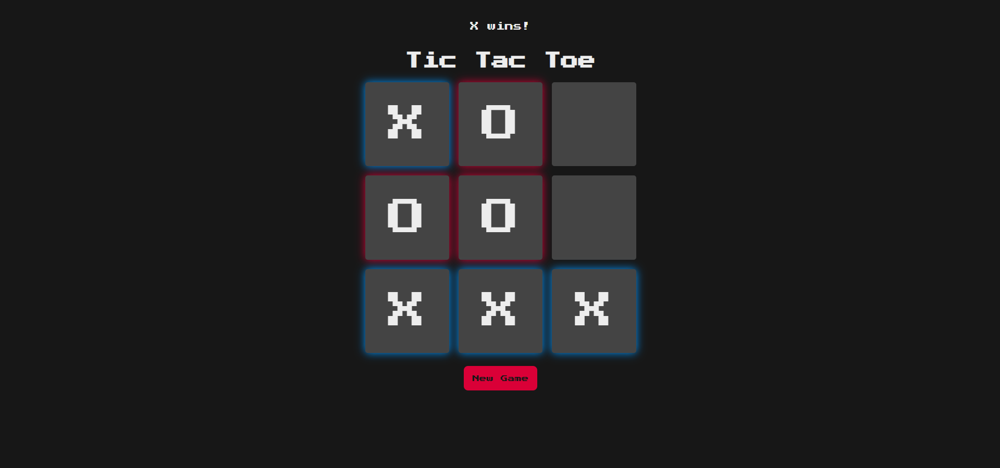
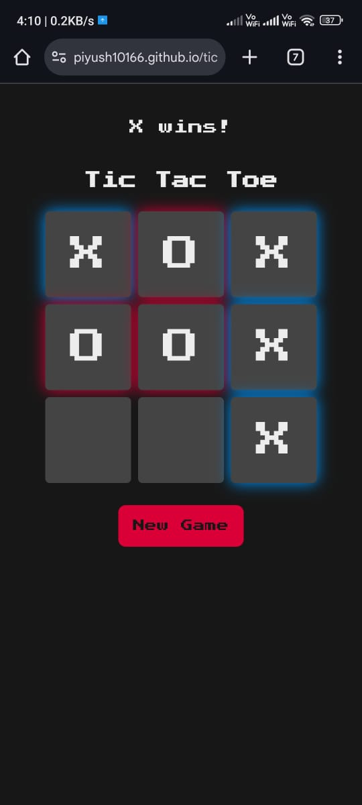

# Tic Tac Toe (JavaScript)
A browser-based Tic Tac Toe game built with vanilla JavaScript to practice DOM manipulation and game logic implementation.(html, css, js)

Live Demo:  
https://piyush10166.github.io/tic-tac-toe_js/

---

## Features

- 2 Player Mode
- Responsive Design (Mobile & Desktop)
- Win Detection Logic
- Reset Game Option
- Retro UI Design

---

## Desktop Preview

<p align="center">
  
</p>

---

## Mobile Preview

<p align="center">
  
</p>

---

## Tech Stack

- HTML5
- CSS3
- JavaScript (Vanilla JS)

---

## Project Structure
```
tic-tac-toe_js/
│── index.html
│── style.css
│── script.js
│── favicon.png
│── pcview_tictactoe.png
│── mobileview.jpeg
```

---

## What I Learned

- DOM manipulation
- Event handling
- Game state management
- Responsive layout using CSS
- Deploying using GitHub Pages

---

## Author

Piyush Pankaj

